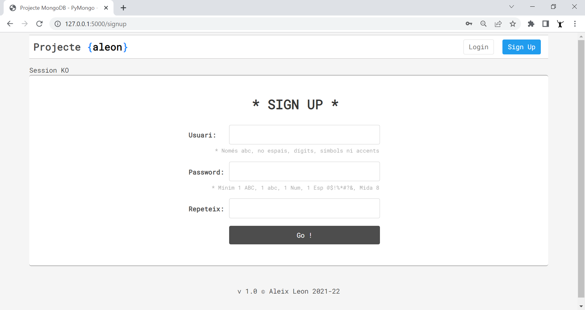

# cataflask

A Flask App example with MongoDB.
Use of web scraping, layout, session, jQuery and Bootstrap 5.
Use of BeautifulSoup, Selenium and ChromeDriver for web scraping.

## Description

Realització d’un projecte d’aprenentatge de mots en català amb tota la seva informació relacionada.

L’aplicació, donada una paraula, buscarà informació de la paraula a diverses webs de caràcter lingüístic de llengua catalana, i la incorporarà a la base de dades.

També avisa si el mot ja existeix.

També fa propostes d’aprenentatge de paraules, i per categories.

Un cop s’obté una paraula, es crearà una fitxa per mot amb tota la informació, i una pàgina per consultes a la base de dades i filtratge per criteris, com tipologia del mot, categoria o cercador per string.

L’aplicació disposa de registre usuari i login a la base de dades, amb les validacions de camps corresponents i encriptació de contrasenya, control de sessió d’usuari, gestió d’errors http 401 (no autoritzat) i 404 (url no trobada).

La maquetació pretén ser neta i clara amb plantilles HTML, re-utilitzant blocs de codi (layouts, includes) i bilding per la sortida de resultats.
Utilitzats estils propis CSS i algun de Bootstrap (per la gestió d’alertes modals).

També utilitzat algun fitxer JavaScript, jQuery per millorar la experiència de l’usuari, tal com elements spinners o les alertes de confirmació.

Tots els fitxers estructurats i ordenats a les seves corresponents carpetes.

Per l’intercanvi d’informació, he utilitzat tan els mètodes GET com POST, o variables de sessió del propi framework. I en algun cas, fitxers, quan la informació és molt gran.

Pel web scraping, a part del BeautifulSoup, he utilitzat Selenium juntament amb el driver del navegador Google Chrome, eina més potent per controlar el DOM d’una pàgina web, permetent, per exemple, agafar resultats quan hi ha més d’una pàgina.

Així doncs, el framework web utilitzat ha estat el Flask, la base de dades MongoDB, i la programació realitzada amb Python, juntament amb la llibreria PyMongo per accés a la base de dades.

L'aplicació també interectura amb còpies de seguretat i restauració de la base de dades, utilitzant les tools de MongoDB, tals com mongodump i restoredump.

## URL scrapejades

*Funcionant a pàgines versions 2021/2022

1. Paraulògic https://vilaweb.cat/paraulogic/ 
Solució del joc, obtenint la llista de paraules dins <script>

2. Rodamots https://rodamots.cat/mots/arxiu-ultims-mots/ 
Mots del dia

3. Rodamots https://rodamots.cat/mots/arxiu-per-categories/ 
Totes les categories de rodamots

4. Rodamots https://rodamots.cat/tema/{categoria} 
Tots els mots d’una categoria en concret

5. Rodamots https://rodamots.cat/{mot}/ 
Fitxa del mot

6. Diec https://dlc.iec.cat/Results?DecEntradaText={mot} 
Fitxa del mot, i obtenció de totes les definicions si hi ha més d’una pàgina 

7. Softcatalà https://www.softcatala.org/diccionari-de-sinonims/pa
raula/{mot}/
Resultats de la cerca. Sinònims

8. Termcat https://www.termcat.cat/ca/cercaterm/{mot}?type=a
dvanced&thematic_area=&language=ca&condition=match&fields=&category=&hierarchy=
Resultats de la cerca.

9. Termes i traduccions
UAB https://dsff.uab.cat/cerca?mode=Conté&frase={mot} 
Resultats de la cerca. Frases fetes

10. Optimot https://aplicacions.llengua.gencat.cat/llc/AppJava/in
dex.html?action=Principal&method=cerca_generica&input_cercar=${mot_sense}&tipusCerca=cerca.tot
Resultats de la 1a pàgina. Cerques.

11. Optimot https://aplicacions.llengua.gencat.cat/llc/AppJava/in
dex.html?action=Principal&method=cerca_generica&input_cercar={mot}&tipusCerca=cerca.fitxes
Resultats de la 1a pàgina. Fitxes lingüístiques.

## Programari utilitzat a la 1a versió

**OS**
Windows 10 Pro 64 bits

**IDE**
Visual Studio Code 1.63.2 - https://code.visualstudio.com/

**DB**
MongoDB server version: 5.0.3
mongodb-database-tools-windows-x86_64-100.5.1
https://www.mongodb.com/

**Llenguatge Programació**
Python 3.9.10 - https://www.python.org/

**Entorn Virtual**
venv - https://docs.python.org/3/library/venv.html

**Gestor Paquets**
pip - https://pypi.org/project/pip/

**Llibreria DB**
pymongo - https://pymongo.readthedocs.io/en/stable/

**Framework / Llibreria**
Flask - https://flask.palletsprojects.com/en/2.0.x/

**Llibreries Web Scraping**
BeautifulSoup - https://www.crummy.com/software/BeautifulSoup/bs4/doc/
Selenium - https://selenium-python.readthedocs.io/
chromedriver v.96 - https://sites.google.com/chromium.org/driver/

**Altres llibreries Python**
passlib, requests, os, time, datetime, re, pickle

**JavaScript**
jQuery 3.6.0 - https://jquery.com/
jQuery LoadingOverlay - https://gasparesganga.com/labs/jquery-loading-overlay/

**CSS**
Bootstrap 5.1.3 - https://getbootstrap.com/

**HTML 5**

## Getting Started

- Download the same version of ChromeDriver as the current version of your browser
- https://sites.google.com/chromium.org/driver/

To run the demo locally, clone the repository and move into it:
- git clone git@github.com:aleongit/cataflask.git
- cd cataflask
- python -m venv venv
- venv\Scripts\activate

## Requeriments
- python >= 3.9
- MongoDB >= 5
- MongoDB Tools

## Install dependencies:
- python -m pip install --upgrade pip
- pip install Flask
- pip install pymongo
- pip install passlib
- pip install requests
- pip install selenium
- pip install beautifulsoup4

## DB and PATH
DB, collections, paths defined in cataflask.py
- DRIVER_PATH = 'driver/chromedriver'
- FILE_TEMP = 'temp.txt'
- MONGO = "mongodb://localhost"
- DB = "cataflask"
- COL_USERS = "users"
- COL_MOTS = "mots"

## Run
- cd cataflask
- venv\Scripts\activate
- python cataflask.py
- Open your browser and go to http://127.0.0.1:5000/
- Sign up on http://127.0.0.1:5000/signup

